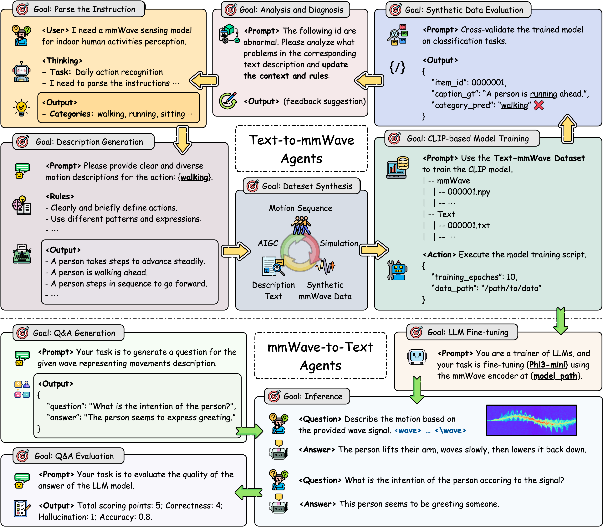

# mmExpert

<div align="center">

**Integrating Large Language Models for Comprehensive mmWave Data Synthesis and Understanding**

[](https://www.python.org/downloads/)
[](https://pytorch.org/)
[](https://huggingface.co/transformers/)
[](https://opensource.org/licenses/Apache-2.0)
[](https://arxiv.org/abs/2509.16521)

</div>

## 🌟 Overview

<div align="center">
  
</div>

**mmExpert-LLM** is the Large Language Model component of the [mmExpert](https://arxiv.org/abs/2509.16521) project, an innovative mmWave understanding framework that integrates Large Language Models for comprehensive mmWave data synthesis and understanding. This project addresses the high costs associated with mmWave data acquisition and annotation by leveraging LLMs to automate the generation of synthetic mmWave radar datasets.

The system processes mmWave signals (representing human motion and activity data) and generates natural language descriptions, answers questions about motion patterns, and provides detailed analysis of human movement sequences. This enables zero-shot generalization in real-world environments and facilitates the successful deployment of large models for mmWave understanding.

> **📄 Paper**: [mmExpert: Integrating Large Language Models for Comprehensive mmWave Data Synthesis and Understanding](https://arxiv.org/abs/2509.16521)  
> **👥 Authors**: Yifan Yan, Shuai Yang, Xiuzhen Guo, Xiangguang Wang, Wei Chow, Yuanchao Shu, Shibo He (Zhejiang University)  
> **📅 Published**: ACM MobiHoc '25

## ✨ Key Features

### 🔄 **Multimodal Architecture**
- **mmWave Signal Processing**: Advanced CLIP-based encoder for mmWave radar data understanding
- **Language Model Integration**: Built on Microsoft Phi-3-mini-4k-instruct for natural language processing
- **Cross-Modal Alignment**: Seamless integration between mmWave signals and text representations

### 🎯 **Core Capabilities**
- **mmWave Data Understanding**: Process and interpret mmWave radar signals for human activity recognition
- **Synthetic Data Generation**: Leverage LLMs to generate synthetic mmWave datasets for specific scenarios
- **Zero-shot Generalization**: Train models capable of generalizing to real-world environments without extensive data collection
- **Human Motion Analysis**: Generate detailed descriptions and analysis of human movements from mmWave data

### 🚀 **Advanced Features**
- **Data Generation Flywheel**: Automated synthetic dataset creation using LLMs
- **LoRA Fine-tuning**: Parameter-efficient training with Low-Rank Adaptation
- **Flash Attention**: Optimized attention mechanisms for better performance
- **Multi-GPU Support**: Distributed training and inference capabilities
- **Comprehensive Evaluation**: Multiple metrics for mmWave understanding assessment

## 🏗️ Architecture

The mmExpert system employs a sophisticated two-stage training architecture:

### Stage 1: CLIP Pre-training
- **Radar Encoder**: Vision Transformer (ViT) with adaptive patch sizing for multi-view mmWave signals
- **Text Encoder**: Pre-trained language models (BERT, RoBERTa, MiniLM, MPNet) with configurable freezing strategies
- **Cross-Modal Alignment**: Contrastive learning for radar-text alignment using CLIP/SigLIP loss
- **Multi-View Support**: Range-time, Doppler-time, and Azimuth-time spectrum processing

### Stage 2: LLM Fine-tuning
- **Base Model**: Microsoft Phi-3-mini-4k-instruct as the core language model
- **Parameter-Efficient Training**: LoRA (Low-Rank Adaptation) for memory-efficient fine-tuning
- **Wave Token Integration**: Specialized tokens for radar signal representation
- **Conversation Templates**: Structured input/output for mmWave understanding tasks

### Key Components
- **Core Abstractions**: Modular design with registry-based component management
- **Experiment Management**: Comprehensive configuration system with automated parameter printing
- **Distributed Training**: Multi-GPU support with DDP and FSDP strategies
- **Evaluation Framework**: Multiple metrics for mmWave understanding assessment

## 📦 Installation

### Prerequisites

- Python 3.8+
- PyTorch 2.0+
- CUDA 11.8+ (for GPU acceleration)
- 16GB+ RAM (32GB+ recommended)

### Environment Setup

```bash
# Clone the repository
git clone <repository-url>
cd mmExpert

# Create conda environment (recommended)
conda create -n mmexpert python=3.8
conda activate mmexpert

# Install PyTorch (adjust CUDA version as needed)
conda install pytorch torchvision torchaudio pytorch-cuda=11.8 -c pytorch -c nvidia

# Install other dependencies
pip install -r requirements.txt
```

### Required Dependencies

```bash
# Core dependencies
pip install transformers>=4.30.0
pip install torch>=2.0.0
pip install pytorch-lightning
pip install einops
pip install sentence-transformers
pip install timm
pip install peft
pip install swanlab

# Computer vision and visualization
pip install opencv-python

# Evaluation dependencies
pip install pycocoevalcap
pip install scikit-learn
pip install scipy

# Configuration and utilities
pip install easydict
pip install yaml
```

## 🚀 Quick Start

### 1. Data Preparation

Prepare your mmWave radar data in the following format:

```python
# mmWave data structure
{
    "filefolder": "path/to/mmwave/files",
    "fileindex": "mmwave_001",
    "captions": ["A person walking forward"],
    "questions": {
        "q1": {"question": "What is the person doing?", "answer": "Walking"}
    }
}
```

### 2. Training

#### Stage 1: CLIP Pre-training
```bash
# Train CLIP with default configuration (CLIP + HumanML3D)
python run_clip.py \
  --data-config config/data/humanml3d.yaml \
  --model-config config/model/clip.yaml \
  --version clip_humanml3d_experiment

# Train SigLIP with adaptive patch sizing
python run_clip.py \
  --data-config config/data/humanml3d.yaml \
  --model-config config/model/siglip.yaml \
  --version siglip_humanml3d_experiment
```

#### Stage 2: LLM Fine-tuning
```bash
# Fine-tune the multimodal model with LoRA
bash scripts/train_r4a8.sh feature/clip_humanml3d_experiment/

# Different LoRA configurations available:
# scripts/train_r8a16.sh    # rank=8, alpha=16
# scripts/train_r16a32.sh   # rank=16, alpha=32
```

### 3. Inference

```python
from src.wavellm import WaveLLMForCausalLM
import torch

# Load the trained model
model = WaveLLMForCausalLM.from_pretrained("path/to/trained/model")
model.get_model().load_wave_encoder("path/to/encoder")

# Prepare input
mmwave_signal = torch.randn(1, 1, 496, 128)  # Example mmWave radar signal
question = "Describe the human motion shown in this mmWave signal."

# Generate response
with torch.no_grad():
    response = model.generate(
        input_wave_embeds=mmwave_signal,
        input_ids=tokenizer.encode(question, return_tensors="pt"),
        max_length=512
    )
```

## 📊 Dataset Support

### Supported Datasets

- **HumanML3D**: Large-scale human motion dataset for mmWave understanding
- **Custom mmWave Data**: Support for custom mmWave radar signals
- **Synthetic Data**: LLM-generated synthetic mmWave datasets for specific scenarios
- **Real-time Data**: Live mmWave radar data processing capabilities

### Data Format

The system supports mmWave radar data represented as wave signals with dimensions `[batch_size, channels, height, width]` where:
- `height`: Temporal dimension (e.g., 496 frames)
- `width`: Feature dimension (e.g., 128 features representing radar signal characteristics)

## 🔧 Configuration

### Data Configuration (`config/data/humanml3d.yaml`)
```yaml
target: src.data_interface.HumanDInterface
params:
  cfg:
    # Dataset splits
    train_split: ['dataset/HumanML3D/_split/train.json']
    val_split: ['dataset/HumanML3D/_split/val.json']

    opt:
      max_motion_length: 496      # Full padded length
      min_motion_len: 96          # Minimum motion length
      max_text_len: 20            # Maximum text caption length
      unit_length: 16             # Unit length for processing
      normalize: 'per_frame'      # Normalization strategy
      radar_views: 'all'          # Radar views: 'all', 'doppler', etc.

    batch_size: 64                # Batch size for training
    num_workers: 1                # Number of data loading workers
```

### Model Configuration

#### CLIP Configuration (`config/model/clip.yaml`)
```yaml
target: src.model.clip.CLIP
params:
  max_epochs: 50
  learning_rate: 5.0e-05
  temperature: 0.07

  encoder_configs:
    radar:
      embed_dim: 256
      dropout: 0.1
    text:
      model_name: 'sentence-transformers/paraphrase-MiniLM-L6-v2'
      embed_dim: 256
      max_length: 77
      freeze_backbone: true
```

#### SigLIP Configuration (`config/model/siglip.yaml`)
```yaml
target: src.model.clip.CLIP
params:
  max_epochs: 200
  learning_rate: 1.0e-04
  use_siglip: true

  encoder_cfg:
    model_name: 'vit_base_patch16_clip_224.openai'
    embed_dim: 256
    adaptive_patch_size: true
    radar_views: 'all'

    # Radar signal resolutions
    range_resolution: [256, 496]
    doppler_resolution: [128, 496]
    azimuth_resolution: [128, 496]

  transformer_width: 256
  transformer_heads: 8
  transformer_layers: 1
```

### LoRA Training Configuration
```yaml
# LoRA configuration (used in scripts)
lora_r: 4                     # LoRA rank
lora_alpha: 8                 # LoRA scaling factor
lora_dropout: 0.05            # Dropout rate
lora_bias: "none"             # Bias type
```

### Experiment Configurations

#### Text Encoder Freezing Strategies
- **Complete Freezing**: Freeze entire text encoder
- **Partial Freezing**: Freeze backbone layers only
- **Projection Only**: Train only projection layers
- **Layer-wise**: Unfreeze specific last layers

#### Text Encoder Architectures
- **BERT**: bert-base-uncased, bert-large-uncased
- **RoBERTa**: roberta-base
- **MiniLM**: paraphrase-MiniLM-L6-v2, paraphrase-MiniLM-L12-v2
- **MPNet**: sentence-transformers/all-mpnet-base-v2

## 📈 Evaluation

### Available Metrics

- **BLEU**: Text generation quality for mmWave descriptions
- **METEOR**: Semantic similarity in motion understanding
- **ROUGE**: Text summarization quality for activity descriptions
- **CIDER**: Consensus-based evaluation for mmWave understanding
- **SPICE**: Semantic propositional evaluation
- **Semantic Similarity**: Cross-modal alignment between mmWave signals and text

### Sample Outputs

Here are some example outputs from the mmExpert-LLM model:

**Example 1: Posture Analysis**
- **Question**: "What is the intention of the person?"
- **Model Prediction**: "The person seems to be adjusting their posture or demonstrating a gesture."
- **Ground Truth**: "The person seems to be moving their arms casually, possibly adjusting posture."

**Example 2: Dance Recognition**
- **Question**: "What is the intention of the person according to the wave signal?"
- **Model Prediction**: "The person intends to dance the waltz."
- **Ground Truth**: "To perform a solo dance in a repeated square pattern."

### Running Evaluation

```bash
# Run comprehensive language evaluation
python evaluation/LanguageEvaluator.py --model_path path/to/model --data_path path/to/test_data

# Run evaluation using the provided evaluation script
bash scripts/eval.sh feature/clip_humanml3d_experiment/

# GPT-based evaluation (for qualitative assessment)
python evaluation/GPTEvaluator.py --model_path path/to/model --data_path path/to/test_data
```

## 🛠️ Advanced Usage

### Custom Training

```python
# Custom dataset integration
from src.datasets.wavellm_dataset import WaveCaptionDataset

# Create custom dataset
dataset = WaveCaptionDataset(
    data_root="path/to/your/data",
    split="train",
    tokenizer=tokenizer
)

# Custom training loop
from src.trainer.train_llm import train

# Configure training arguments
training_args = TrainingArguments(
    output_dir="./output",
    per_device_train_batch_size=4,
    learning_rate=5e-4,
    num_train_epochs=3,
    lora=True,
    lora_r=8,
    lora_alpha=16
)
```

### Model Customization

```python
# Custom wave encoder
from src.model.clip import ImageEncoder

custom_encoder = ImageEncoder(
    model_name='vit_base_patch16_224',
    embed_dim=512,
    image_resolution=[496, 128]
)

# Custom projection layers
projection_layers = nn.Linear(512, model.config.hidden_size)
```

## 🛠️ Development Tools

### Data Visualization
```bash
# Visualize radar data with heatmaps and motion plots
python tools/view_data.py --config config/data/humanml3d.yaml --num_samples 5
```

### Model Inspection
```bash
# Inspect text encoder architecture and freezing strategies
python tools/inspect_text_encoder.py --config config/model/clip.yaml

# Preview freezing strategies before training
python tools/preview_freezing_strategies.py --experiment-dir config/model/experiments-freeze-layers/
```

### Configuration Validation
```bash
# Test configuration files for validity
python -c "from src.misc.tools import instantiate_from_config; from src.misc.io import load_config; cfg = load_config(None, 'config/data/humanml3d.yaml', 'config/model/clip.yaml'); print('Configuration is valid!')"
```

## 📁 Project Structure

```
mmExpert/
├── README.md                   # Project documentation
├── run_clip.py                 # CLIP pre-training main entry point
├── evaluate_clip.py           # CLIP evaluation script
├── src/                       # Source code directory
│   ├── core/                  # Core abstractions and base classes
│   │   ├── base.py            # Base classes for encoders, models, data
│   │   ├── registry.py        # Component registry
│   │   ├── factory.py         # Factory for instantiation
│   │   ├── injection.py       # Dependency injection
│   │   └── pipeline.py        # Pipeline implementation
│   ├── wavellm/               # WaveLLM (LLM component)
│   │   ├── modeling_wavellm.py # Main WaveLLM model architecture
│   │   ├── conversation.py    # Conversation templates
│   │   └── __init__.py
│   ├── model/                  # Model implementations
│   │   ├── clip_model.py      # Main CLIP model implementation
│   │   ├── clip.py            # CLIP interface and legacy components
│   │   ├── clip_loss.py       # CLIP/SigLIP loss functions
│   │   ├── clip_transformer.py # Transformer components
│   │   └── sequence_similarity.py # Sequence similarity computation
│   ├── encoders/              # Encoders for different modalities
│   │   ├── radar_encoder.py   # Radar signal encoder
│   │   └── text_encoder.py    # Text encoder
│   ├── datasets/              # Dataset implementations
│   │   ├── wavellm_dataset.py  # Main WaveLLM dataset
│   │   └── base_dataset.py     # Base dataset utilities
│   ├── trainer/               # Training components
│   │   ├── wavellm_trainer.py # WaveLLM trainer
│   │   ├── train_llm.py      # LLM fine-tuning script
│   │   └── eval_llm.py        # LLM evaluation script
│   └── misc/                  # Utilities and tools
│       ├── tools.py           # General utilities
│       ├── io.py              # I/O utilities
│       ├── config_printer.py  # Configuration printing
│       └── llm_utils.py       # LLM utilities
├── config/                    # Configuration files
│   ├── data/                  # Data configurations
│   │   └── humanml3d.yaml     # HumanML3D dataset configuration
│   └── model/                 # Model configurations
│       ├── clip.yaml          # CLIP model configuration
│       ├── siglip.yaml       # SigLIP model configuration
│       ├── experiments-freeze-layers/  # Text encoder freezing experiments
│       └── experiments-text-encoder/   # Text encoder experiments
├── dataset/                   # Dataset storage
│   └── HumanML3D/             # HumanML3D dataset structure
├── evaluation/                # Evaluation components
│   ├── LanguageEvaluator.py   # Language evaluation metrics
│   ├── GPTEvaluator.py        # GPT-based evaluation
│   └── eval_example/          # Evaluation examples
├── scripts/                   # Training and evaluation scripts
│   ├── train_r4a8.sh         # LoRA training script (r=4, alpha=8)
│   ├── train_r8a16.sh        # LoRA training script (r=8, alpha=16)
│   ├── train_r16a32.sh       # LoRA training script (r=16, alpha=32)
│   └── eval.sh               # Evaluation script
├── tools/                     # Development and analysis tools
│   ├── view_data.py          # Data visualization tool
│   ├── inspect_text_encoder.py # Text encoder inspection
│   ├── preview_freezing_strategies.py # Strategy preview
│   └── extrack_model_weight.py # Model weight extraction
├── huggingface/               # Cached HuggingFace models (offline mode)
├── log/                       # Training logs and checkpoints
├── results/                   # Evaluation results
├── feature/                   # Feature outputs and embeddings
├── swanlog/                   # SwanLab experiment logs
├── benchmark/                 # Benchmarking tools and results
├── doc/                       # Additional documentation
└── tmp/                       # Temporary files and cache
```

## 🔍 Key Features

### Experiment Management
- **Configuration Printing**: Automatic display of core parameters before training
- **Batch Evaluation**: Comprehensive evaluation with multiple metrics
- **Checkpoint Management**: Automatic saving and loading of model checkpoints
- **SwanLab Integration**: Real-time experiment tracking and visualization

### Advanced Training Features
- **Multi-GPU Training**: Distributed training with DDP strategy
- **Offline Model Support**: Large model cache for offline training
- **Adaptive Patch Sizing**: Dynamic patch sizes for different radar resolutions
- **Multi-View Processing**: Simultaneous processing of range, doppler, and azimuth views

### Development and Debugging
- **Rich Visualization Tools**: OpenCV-based data visualization with consistent colormaps
- **Configuration Validation**: Pre-training validation of configuration files
- **Model Inspection**: Detailed analysis of encoder architectures and freezing strategies
- **Performance Monitoring**: Real-time tracking of training and evaluation metrics
