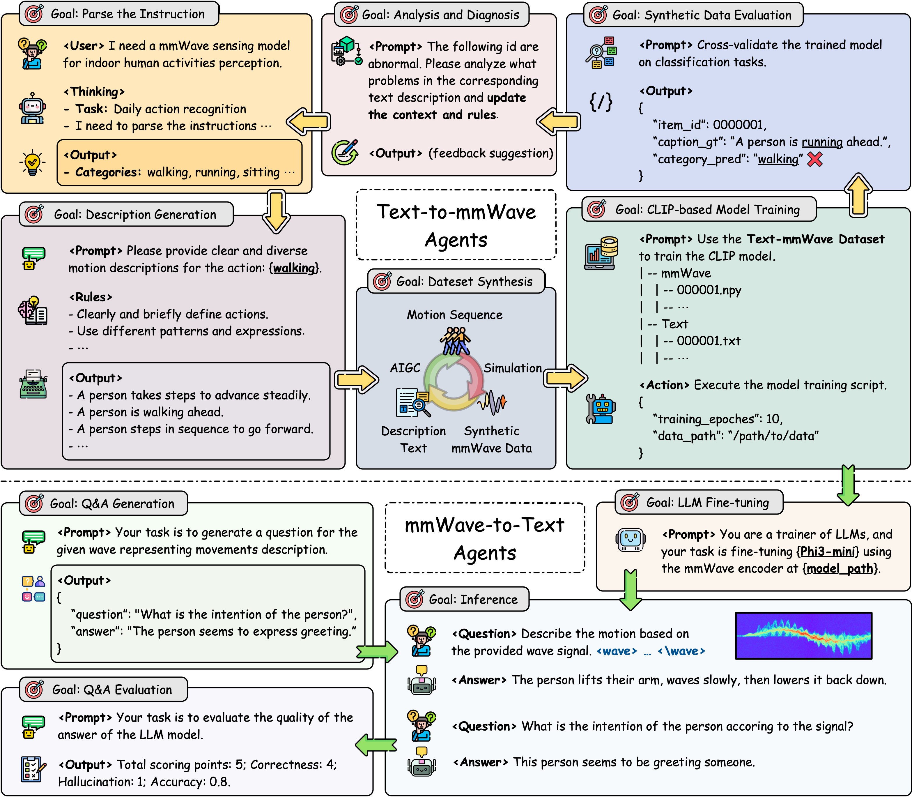

# mmExpert

Public implementation of **mmExpert**, covering language-guided mmWave data
synthesis and mmWave-language model training.

[Paper (MobiHoc 2025)](https://arxiv.org/abs/2509.16521) | [Supplementary demonstration](https://luckyyf0517.github.io/mmExpert-Page/)

<p align="center">
  
</p>

## Components

The repository is organized around the two main parts of the framework:

- `data-generate-pipeline/`: planner-guided prompt generation, HY-Motion 1.0
  motion synthesis, iterative feedback, and mmWave simulation.
- `model-training/`: radar-text contrastive pretraining, WaveLLM Stage 1/2
  training, and QA generation.

The simulator accepts three motion representations:

- SMPL pose and translation sequences, converted to surface meshes;
- HY-Motion pose and translation artifacts, converted to animated meshes;
- 3D joint sequences, converted to point scatterers.

Use `simulation_hymotion_mesh.yaml` for the HY-Motion pipeline described in the
paper. `simulation_joints.yaml` provides a separate point-scatterer interface
for custom joint-sequence inputs.

Datasets, API credentials, model checkpoints, trained weights, experiment
logs, and licensed SMPL-family body-model files are not included.

## Requirements

- Python 3.10
- A CUDA-capable GPU for HY-Motion inference and model training
- An OpenAI-compatible API endpoint for prompt or QA generation

## Installation

Clone recursively so the pinned HY-Motion dependency is available:

```bash
git clone --recurse-submodules https://github.com/luckyyf0517/mmExpert.git
cd mmExpert
```

If the repository was cloned without submodules:

```bash
git submodule update --init --recursive
```

Create a Python 3.10 environment and install the shared dependencies. Install
a PyTorch build compatible with the local CUDA runtime when GPU support is
required.

```bash
python -m venv .venv
source .venv/bin/activate
pip install --upgrade pip
pip install -r requirements.txt
```

For motion synthesis, follow the setup instructions in
`data-generate-pipeline/backends/hymotion/README.md` and install its additional
dependencies:

```bash
pip install -r data-generate-pipeline/backends/hymotion/requirements.txt
```

Download the HY-Motion 1.0 checkpoints according to the upstream instructions.
The default expected directory is:

```text
data-generate-pipeline/backends/hymotion/ckpts/tencent/HY-Motion-1.0/
```

You may instead set `HY_MOTION_MODEL_PATH`. The standalone SMPL input path
requires a legally obtained SMPL model and the `human_body_prior` package; set
`SMPL_MODEL_PATH` to the neutral model file.

## Data-generation pipeline

All commands in this section run from `data-generate-pipeline/`:

```bash
cd data-generate-pipeline
cp .env.example .env
```

Set `OPENAI_API_KEY` in `.env`. `OPENAI_BASE_URL` defaults to the official
OpenAI endpoint and can be overridden for a compatible service.

Initialize a prompt-generation task:

```bash
python run_flywheel.py --output-dir datasets/daily_activity init \
  --round 0 \
  --tasks "Generate diverse human motions for daily activities." \
  --total-count 100
```

Run one generation round without classifier feedback:

```bash
python run_flywheel.py --output-dir datasets/daily_activity run \
  --round 0 --max-rounds 1 --no-feedback
```

The generated `round_0/info.json` contains the planner configuration and can be
edited before execution. Individual stages are also exposed as `step1`,
`step2`, `step3`, and `step4`; use `python run_flywheel.py --help` for the full
CLI.

### Standalone mmWave simulation

The supplied YAML configurations cover mesh and joint inputs. Set the data
root to the directory expected by the selected configuration, then run:

```bash
export MMEXPERT_DATA_ROOT=/absolute/path/to/data

# HY-Motion pose/translation artifacts -> animated mesh -> micro-Doppler
python simulator/run_simulation.py \
  --config simulator/configs/simulation/simulation_hymotion_mesh.yaml --yes

# Joint sequences -> point scatterers -> micro-Doppler
python simulator/run_simulation.py \
  --config simulator/configs/simulation/simulation_joints.yaml --yes

# SMPL parameters -> surface mesh -> micro-Doppler
export SMPL_MODEL_PATH=/absolute/path/to/smplh/neutral/model.npz
python simulator/run_simulation.py \
  --config simulator/configs/simulation/simulation_smpl.yaml --yes
```

Adjust `data_pattern`, `output_dir`, radar placement, and simulation options in
the YAML files for a local dataset.

## Model training

From the repository root, enter the training directory:

```bash
cd model-training
```

The example configurations expect split files under `data/humanml3d/` and
write generated artifacts to ignored `log/`, `features/`, and `outputs/`
directories.

To create the split manifests, place matching micro-Doppler arrays and caption
files under `data/humanml3d/udoppler/` and `data/humanml3d/texts/`, together
with the HumanML3D `train.txt` and `test.txt` files, then run:

```bash
python src/scripts/split_humanml3d.py
```

### 1. Radar-text contrastive pretraining

```bash
python train_clip.py \
  --model-config config/model/clip.yaml \
  --data-config config/data/humanml3d.yaml
```

For distributed training, launch the same command with `torchrun` and set
`--strategy ddp`.

### 2. Extract the radar encoder

```bash
python tools/extract_model_weight.py \
  --checkpoint log/<experiment>/<version>/checkpoints/last.ckpt \
  --output-root features
```

Point `encoder_path` and `data_root` in the WaveLLM configurations to the
resulting encoder directory.

### 3. Train WaveLLM

Stage 1 uses caption supervision:

```bash
python train_llm.py --config config/llm/phi3_stage1.yaml --no_deepspeed
```

Stage 2 uses caption and QA supervision and can initialize from the Stage 1
output:

```bash
python train_llm.py \
  --config config/llm/phi3_stage2.yaml \
  --init_checkpoint outputs/<stage1-checkpoint> \
  --no_deepspeed
```

Remove `--no_deepspeed` and use a DeepSpeed launcher for distributed training.

## QA generation

`benchmark/make_QAs.py` converts caption records into exactly four validated
QA roles: Activity Category (`QA01`), Action Sequence (`QA02`), High-Level
Intent (`QA03`), and Motion Detail (`QA04`). It requires `OPENAI_API_KEY` and
accepts an optional `.env` file.

```bash
python benchmark/make_QAs.py \
  --train_json data/humanml3d/train.json \
  --test_json data/humanml3d/test.json \
  --output_dir data/humanml3d \
  --num_workers 8 \
  --env_file ../data-generate-pipeline/.env
```

Each input record must provide `filefolder`, `fileindex`, and `captions`.
Generated records add a `questions` mapping with deterministic QA role IDs.

## Project structure

```text
mmExpert/
|-- assets/
|-- data-generate-pipeline/
|   |-- backends/hymotion/       # pinned upstream submodule
|   |-- flywheel/                # prompt, motion, and feedback orchestration
|   `-- simulator/               # mesh and joint RF simulation
|-- model-training/
|   |-- benchmark/               # QA generation
|   |-- config/                  # public training configurations
|   `-- src/                     # CLIP and WaveLLM modules
|-- LICENSE
|-- NOTICE.md
`-- requirements.txt
```

## Citation

```bibtex
@inproceedings{yan2025mmexpert,
  title={mmexpert: Integrating large language models for comprehensive mmwave data synthesis and understanding},
  author={Yan, Yifan and Yang, Shuai and Guo, Xiuzhen and Wang, Xiangguang and Chow, Wei and Shu, Yuanchao and He, Shibo},
  booktitle={Proceedings of the Twenty-sixth International Symposium on Theory, Algorithmic Foundations, and Protocol Design for Mobile Networks and Mobile Computing},
  pages={1--10},
  year={2025}
}
```

## License

The mmExpert code in this repository is released under the Apache License 2.0.
The HY-Motion submodule and external model/data artifacts remain subject to
their own licenses; see `NOTICE.md`.
